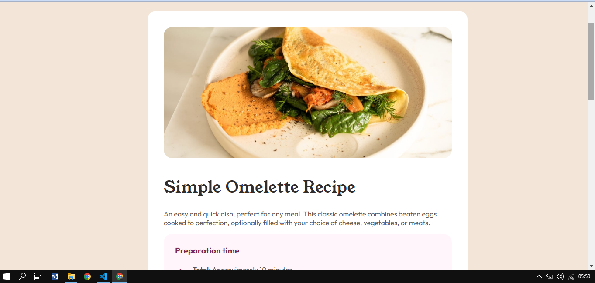
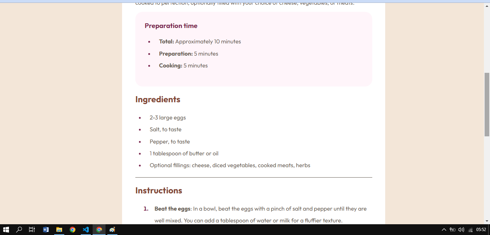
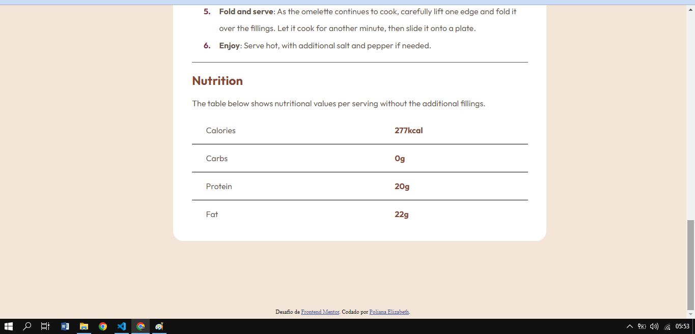

# Frontend Mentor - Solução de página de receita

Esta é uma solução para o [desafio da página de receitas no Frontend Mentor](https://www.frontendmentor.io/challenges/recipe-page-KiTsR8QQKm). Os desafios do Frontend Mentor ajudam você a melhorar suas habilidades de codificação através da construção de projetos realistas.

## Índice

- [Visão geral](#Visão-geral)
  - [O desafio](#O-desafio)
  - [Screenshot](#screenshot)
  - [Links](#links)
- [Meu processo](#Meu-Processo)
  - [Tecnologias usadas](#Tecnologias-usadas)
  - [O que eu aprendi](#O-que-eu-aprendi)
  - [Desenvolvimento contínuo](#Desenvolvimento-contínuo)
  - [recursos úteis](#Recursos-úteis)

## Visão geral

### O desafio

O desafio consistia em recriar uma pagina de receitas. Foram dados algumas informações para esta realização, como tamanho das fontes e cores usadas. E com isso e olhando um print do resultado deveria deixar a pagina o mais parecido possível com o proposto.

### Screenshot

### Links

- Solução URL: [Add solution URL here](https://your-solution-url.com)

## Meu processo

### Tecnologias usadas

- HTML5
- CSS

### O que eu aprendi

Uma das coisas que aprendi que gostei bastante foi sobre como mudar o marcador de uma lista. 
li::marker {
    color:hsl(332, 51%, 32%);
    font-weight: bold;
  }

Esse é um dos comandos que eu desconhecia e achei muito interessante.

### Desenvolvimento contínuo

Tive dificuldade ao usar a flex box. Esse é um recurso que pretento aperfeiçoar para desenvolver melhor meus projetos. e também saber lidar com border e padding dos elementos, quando usar cada um.

### Recursos úteis

- [Guia de flex box](https://css-tricks.com/snippets/css/a-guide-to-flexbox/) -Isso me ajudou a ter uma noção melhor do flex box e pretendo estudar melhor para aplicá-lo em projetos futuros.
